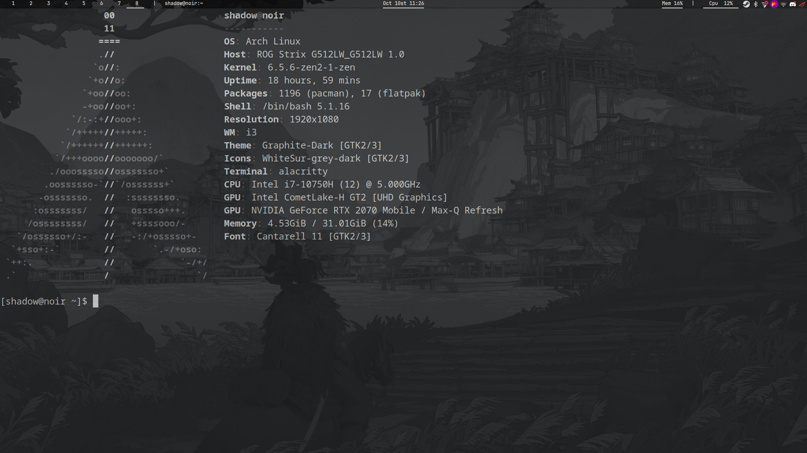

# dotfiles


# Dependancies
```
paru -Syyu gnome-themes-extra gtk-engine-murrine emacs fd ripgrep vim visual-studio-code-bin nitrogen vivaldi vivaldi-ffmpeg-codecs noto-fonts nerd-fonts brightnessctl network-manager-applet file-roller neofetch pavucontrol blueberry lxappearance discord rofi git dmenu abs cron obquit caffeine-ng xautolock zoom flameshot picom-git polybar spotify awesome-git networkmanager-dmenu-git snap-pac-grub
```

# Theme
```
git https://github.com/vinceliuice/Graphite-gtk-theme
```
```
cd Graphite-gtk-theme/
```
```
./install.sh --gdm --tweaks black
```
```
cd other/grub2
```
```
./install.sh
```

# Icons
```
git clone https://github.com/vinceliuice/WhiteSur-icon-theme.git
```
```
cd WhiteSur-icon-theme
```
```
./install.sh --theme grey --alternative
```
